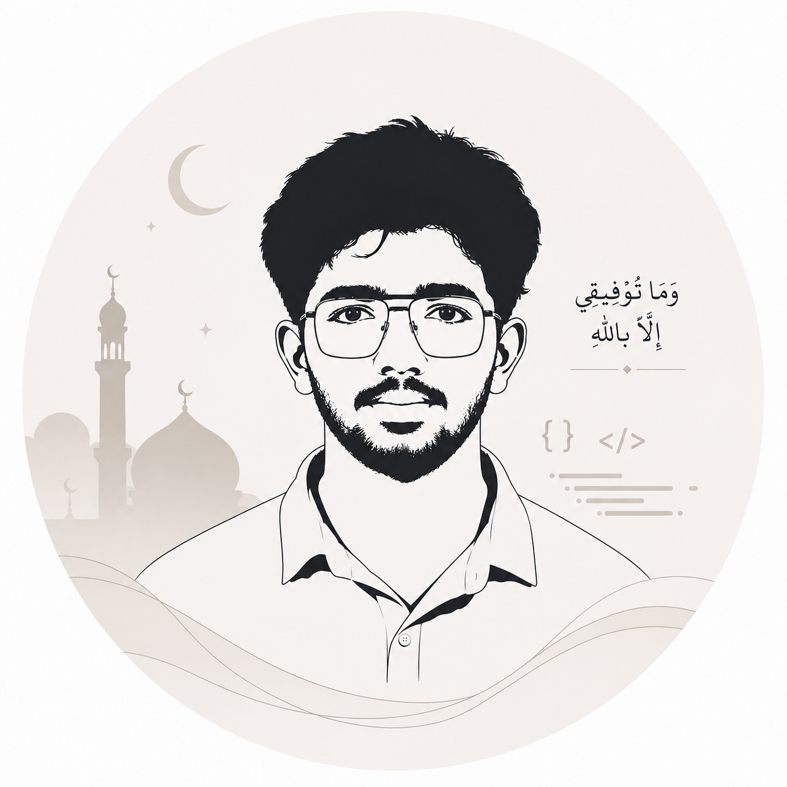

-->

 

  

# Muhammed Mish-Al

<strong>AI Engineer&nbsp;&nbsp;·&nbsp;&nbsp;Full Stack Developer&nbsp;&nbsp;·&nbsp;&nbsp;Machine Learning</strong>

 

I build production-ready systems at the intersection of AI and software engineering — from model to backend to interface.

  

<!-- OPTIONAL: add a Portfolio badge once you have a site —
 -->

 

&nbsp;

## About

- 🎓 B.Tech in Artificial Intelligence &amp; Machine Learning
- 🧠 Focused on **AI**, **Machine Learning**, **AI Agents**, **Backend** &amp; **Full Stack Development**
- 🌱 Currently deepening my knowledge of **FastAPI**, **Docker**, **AWS**, and **MLOps**
- 🎯 Goal — build production-ready AI systems that solve real-world problems

&nbsp;

## Tech Stack

**Languages**
 

 

**Frontend**
 

 

**Backend**
 

 

**AI / ML**
 

 

**Database**
 

 

**Tools &amp; Cloud**
 

&nbsp;

## Featured Projects

<table>
<tr>
<td width="50%" valign="top">

### AI PDF Chat
Conversational interface for querying PDF documents using retrieval-augmented generation.
<!-- REPLACE: repo URL -->
**[View Repository →](https://github.com/Muhammed-Mish-Al/ai-pdf-chat)**

</td>
<td width="50%" valign="top">

### Medical Billing System
Full-stack system for managing and automating medical billing workflows.
<!-- REPLACE: repo URL -->
**[View Repository →](https://github.com/Muhammed-Mish-Al/medical-billing-system)**

</td>
</tr>
<tr>
<td width="50%" valign="top">

### Medical Diagnosis Assistant
ML-driven assistant that supports preliminary diagnostic insights from patient data.
<!-- REPLACE: repo URL -->
**[View Repository →](https://github.com/Muhammed-Mish-Al/medical-diagnosis-assistant)**

</td>
<td width="50%" valign="top">

### Resume Analyzer
NLP tool that parses and scores resumes against job descriptions.
<!-- REPLACE: repo URL -->
**[View Repository →](https://github.com/Muhammed-Mish-Al/resume-analyzer)**

</td>
</tr>
<tr>
<td width="50%" valign="top">

### AI Customer Support Bot
Agent-based support bot handling customer queries with contextual memory.
<!-- REPLACE: repo URL -->
**[View Repository →](https://github.com/Muhammed-Mish-Al/ai-customer-support-bot)**

</td>
<td width="50%" valign="top">

### Portfolio Website
Personal developer portfolio showcasing projects, experience, and writing.
<!-- REPLACE: repo URL -->
**[View Repository →](https://github.com/Muhammed-Mish-Al/portfolio)**

</td>
</tr>
</table>

&nbsp;

## GitHub Statistics

 

  

&nbsp;

## Connect

&nbsp;

<em>"And say, 'My Lord, increase me in knowledge.'"</em> — Qur'an 20:114

&nbsp;
